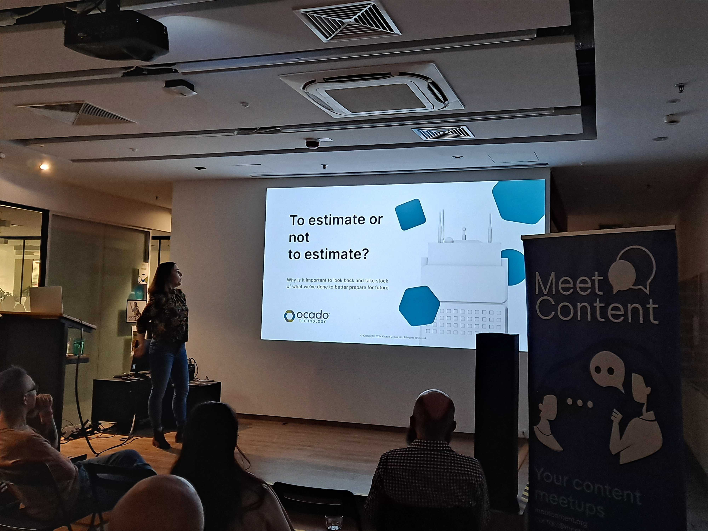
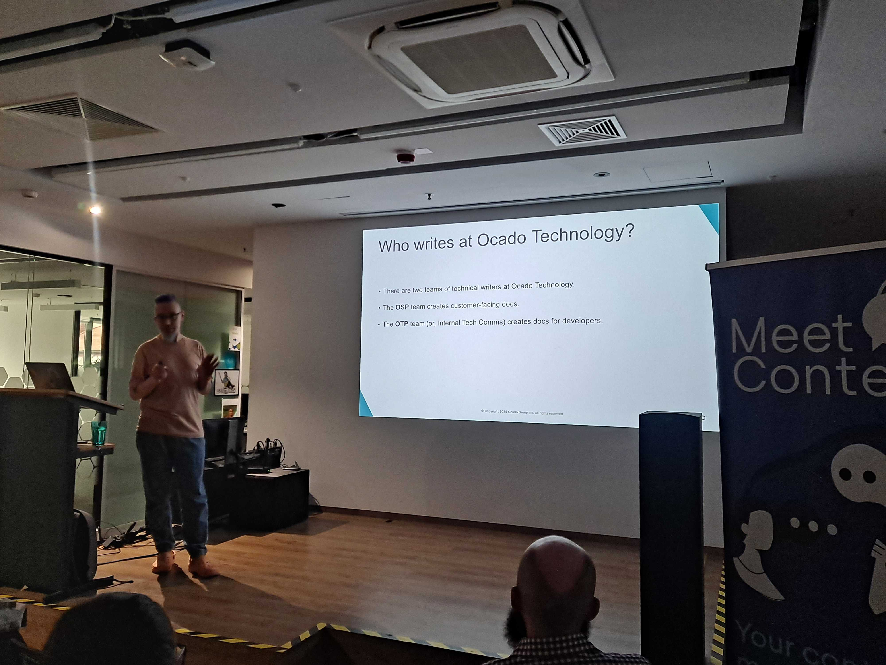
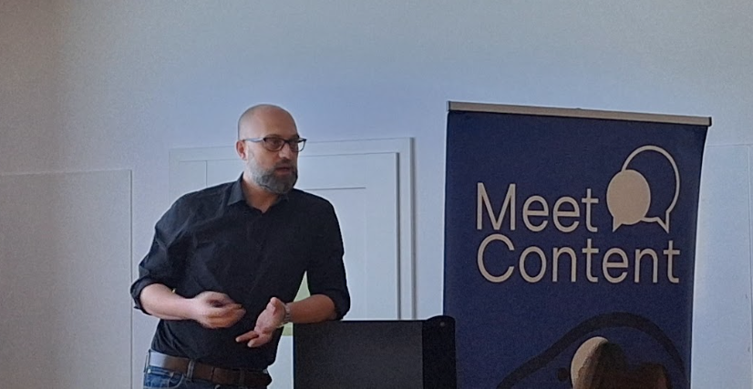

W kwietniu MeetContentWRO gościł w Ocado Technology. W tym nowoczesnym biurze w centrum Wrocławia spotkaliśmy się  już drugi raz.

Na ocadowskiej scenie wystąpiła dwójka pracowników firmy: 

<!--truncate-->

* [Monika Mrozek](https://www.linkedin.com/in/monika-mrozek/), Lead Technical Writer, z prezentacją *To commit or not to commit: Reflection on estimation*, oraz 
* [Paweł Martin](https://www.linkedin.com/in/pawel-martin/), Technical Writer, z wystąpieniem *Hats, snakes, and portals or: How to DITA without DITA*

## SAiIT

Jednak zanim zaczęły się prezentacje, wystąpił [Łukasz Rybka](https://www.linkedin.com/in/%C5%82ukasz-rybka-364a81190/) i zaprezentował inicjatywę utworzenia **Stowarzyszenia Autorów i Ilustratorów Technicznych**.  

Stowarzyszenie ma na celu między innymi rejestrację zawodów z dziedziny komunikacji technicznej w GUS i ZUS czy też opracowanie założeń, wymagań i standardów zawodowych.

O rozwoju [SAiIT](https://www.linkedin.com/in/saiit-polska-03a008308/) możecie już teraz przeczytać na LinkedIn. 

Niedługo z pewnością napiszemy więcej o tej inicjatywie na łamach TechWriterPL.  

## Estymacja

Monika opowiedziała, jak ona i jej zespół postanowili znaleźć sposób aby efektywnie mierzyć i prognozować obłożenie pracą.

### Po co? 

Brakowało im efektywnego sposobu na śledzenie zmian w obciążeniu Tech Writerów. Nie mieli metody na porównywanie wielkości zadań. Wierzyli też, że lepsze planowanie uczyni ich przewidywalnym partnerem dla innych działów w firmie. 

W perspektywie, chcieli też mieć czym argumentować ewentualną konieczność rozbudowania zespołu. 

### Jak sie za to zabrali? 
Poprzez warsztaty, w które zaangażowany był cały zespół. Wyszli z założenia, że ich praca obejmuje powtarzalne elementy i czynności, które można zidentyfikować i wyodrębnić.

Zidentyfikowali więc rodzaje zadań, np. dokumentacja nowego atrybutu w istniejącym API, czy nowej funkcjonalności w aplikacji mobilnej. 

Na każde takie zadanie składają się powtarzalne komponenty, które Monika i jej zespół zidentyfikowali. Między innymi wyodrębnili: spotkanie z SME, zapoznanie się z rezultatem tzw. *product discovery* lub wynikami *user research*, no i oczywiście - samo pisanie! 

Następnie, wspólnie ustalili, jaki czas średnio przeznaczają na każdy z takich komponentów - w zależności od stopnia skomplikowania zadania. Na przykład, rozmowa z SME może być wyraźnie dłuższa jeśli do udokumentowania jest przekrojowa funkcjonalność w porównaniu z drobną aktualizacją istniejącej funkcjonalności. 

### Co z tego wynikło? 

Zespół przyjął podział zadań według rozmiarów t-shirtów (XS, S, M, L i XL). 

A więc, jeśli każdy rodzaj zadania składa się z określonych komponentów, w wyniku warsztatu mają one teraz przypisany szacowany czas, jaki zajmie Tech Writerowi ukończenie tego zadania - w zależności czy mamy do czynienia z zadaniem ocenionym przez zespół na przykład jako  S lub L.

W ramach tego eksperymentu, ocadowscy Tech Writerzy zaczęli też rejestrować czas poświęcony na peer review. 

### Efekt? 

Na tamten moment eksperyment trwał zaledwia dwa kwartały ale były już pierwsze wnioski. Na przykład: poziom obciążenia pracą się zmienia. Ale kiedy zmniejsza się ilość zadań związanych z rozwojem produktu (*development-related*), zwiększa się ilość zadań nakierowanych na ulepszanie samej dokumentacji i odwrotnie.

Rejestrowanie godzin poświęconych na wzajemne sprawdzanie swojej pracy, przyniosło konkretne liczby, które również dają do myślenia. Szczególnie w kontekście ewentualnych rozmów na temat zaprzęgnięcia narzędzi wykorzystujących AI. 

Eksperyment wciąż trwa, a zespół zgodził się że aktualne podejście będzie wymagało kalibracji. Jednak już teraz zespół ma większą pewność w określaniu swoich zobowiązań i ram czasowych na ich wykonanie.

***

## How to DITA without DITA

Następnie Paweł Martin przedstawił, w jaki sposób osiągnąć funkcjonalności znane z architektury DITA w Markdownie.

Paweł jest częścią zespołu Internal Tech Comms, tworzącego dokumentację dla deweloperów. Aktualnie tworzą część dokumentacyjną portalu dla deweloperów opartego na technologii Backstage od Spotify.

Aby zbudować sprawny portal, potrzebowali:

* Wtyczki *kroki* - do tworzenia diagramów
* Monorepo - czyli repozytorium przechowującego kod wielu projektów
* A gdy już mieli jedno repozytorium - sposobu na powtórne użycie elementów, czyli *reuse*

Udało im się znaleźć sposób na odtworzenie funkcji *reuse* w Markdownie za pomocą *snippetów*. *Snippet* to plik Markdownowy, który można osadzić w innym pliku *.md*. 

Umieszcza się go przy pomocy takiego kodu:

`--8<-- "snippet.md"`

W efekcie treść pliku *snippet.md* jest wyświetlana w dokumencie docelowym.

### Zalety

Do największych należy fakt, że *content reuse* w ogóle jest możliwy. A więc treść snippeta aktualizujemy raz, a każde miejsce w dokumentacji, które ten snippet wykorzystuje pokaże nam już zaktualizowaną wersję. 

Snippety można wykorzystywać na przykład do automatyzacji wersjonowania, zarządzania zmianą nazw produktów czy powielania standardowych, powtarzalnych elementów dokumentacji.

### Wady

Do wad należą następujące ograniczenia:

* Nie da się umieszczać snippetów w snippetach
* Nagłówki w snippecie nie są kontynuacją nagłówków docelowego dokumentu
* Zamieszczanie ilustracji w snippecie jest... skomplikowane

Zespół Pawła wciąż jednak pracuje nad usprawnieniem tej metody. A już teraz snippety pozwalają im korzystać z funkcji DITA bez faktycznego używania DITA.

Rzecz jasna meetup zakończył się pizza party 🍕 🍹 🤩

***

## Co dalej?

Wrocławski sezon contentowy zamkniemy już **22 maja**. 

Tym razem widzimy się w siedzibie firmy Etteplan. 

Żeby solidnie wejść w contentowy sezon ogórkowy 😉, w Etteplan czekają nas również dwie prezentacje:

* [Basia Kardel-Piątkowska](https://www.linkedin.com/in/barbara-kardel-piatkowska/) i Knowledge transfer and retention in a Technical Communication team
* [Maciek Chudański](https://www.linkedin.com/in/maciekchudanski/) i Visual Design in Technical Communication

Zapisy w formularzu pod [TYM LINKIEM](https://forms.gle/b6YrWoYG7teRorT38)! 👋

Do zobaczenia!

***

Artykuł powstał przy współpracy z Janem Sosną

  