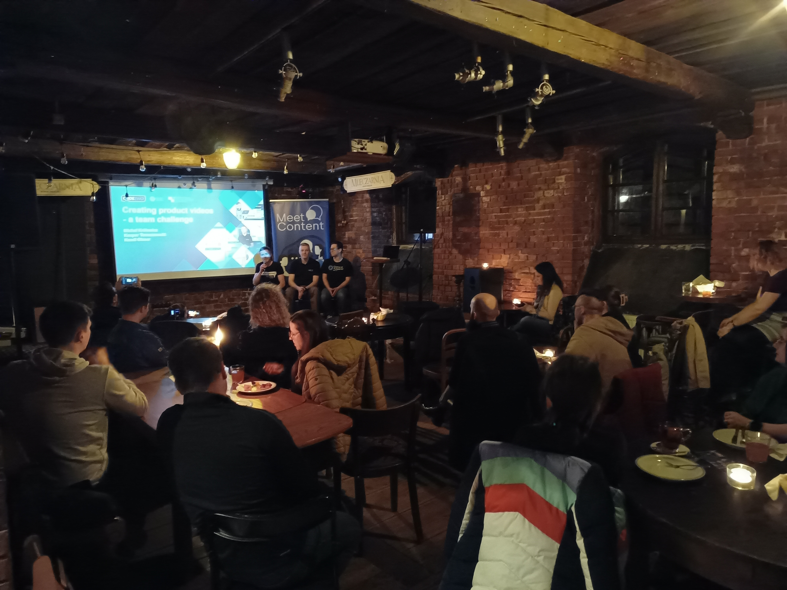
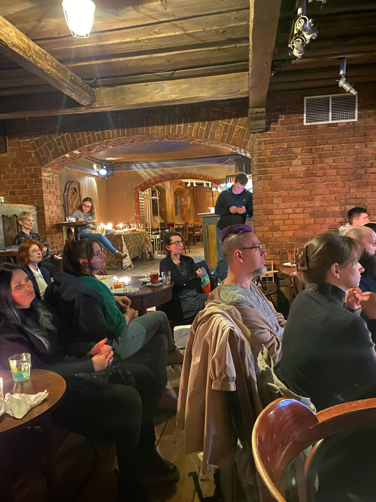
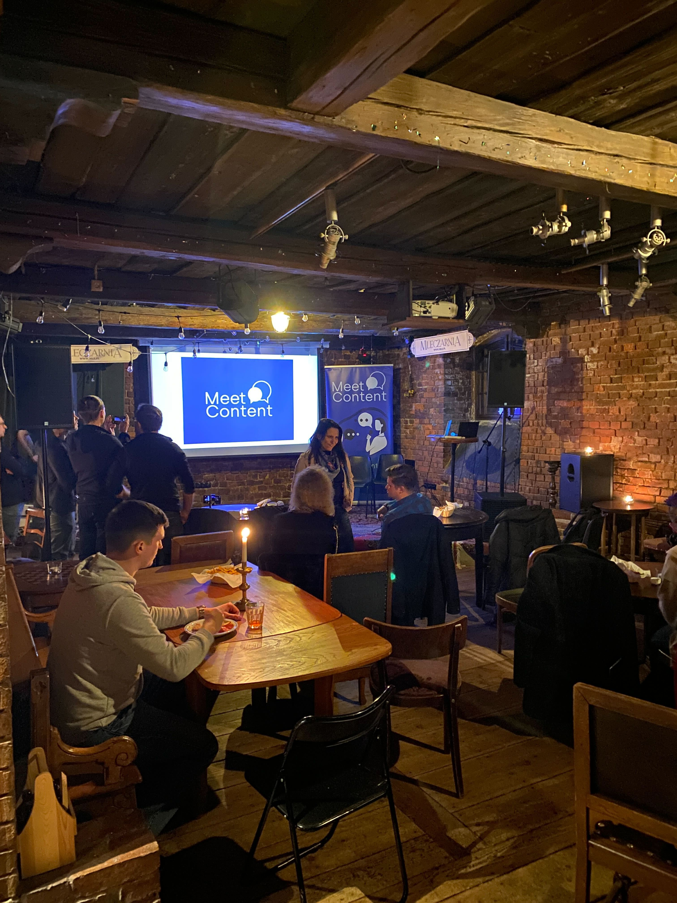

27 lutego spotkaliśmy się niestandardowo - w słynnej wrocławskiej klubokawiarni Mleczarnia, żeby posłuchać o tym, jak robi się filmiki produktowe. 

Naszym gospodarzem tym razem była, skądinąd znana i umiejąca w filmiki, firma z branży IT - **CodeTwo**.

<!--truncate-->

Prezentację na temat: *Creating product videos - a team challenge* brawurowo i z humorem dostarczyli:  

* [Michał Królewicz](https://www.linkedin.com/in/mkrolewicz/), który jest Technical Marketing Managerem, 
* [Kacper Tomaszewski](https://www.linkedin.com/in/kacpertomaszewski/), który jest Senior Graphic & UI/UX Designerem, oraz 
* [Kamil Glaser](https://www.linkedin.com/in/kamil-glaser-92b91482/), który jest Senior Technical Marketing Specialist

## Po co tworzyć filmy produktowe?

Ekipa z CodeTwo zaczęła od podstaw - czyli od *dlaczego*.

Otóż okazuje się, że treści video są wyżej indeksowane przez wyszukiwarki, a więc mają większą szansę pojawić się w wynikach wyszukiwania niż treści pisane. Ponadto, wszyscy wiemy, że coraz mniej ludzi chce czytać i jeśli ma do wyboru filmik lub manual, wybiorą filmik. 

Video produktowe pomagają również w marketingu firmy, promocji produktu i danej funkcjonalności. 

### O czym robić filmiki produktowe? 

Jak już zdecydujemy, że chcemy je robić, trzeba zastanowić się i wybrać, jakie funkcjonalności najlepiej w tych filmikach pokazać.  

W CodeTwo filmowe scenariusze przychodzą z wielu miejsc - z nowymi wydaniami programów na czele. Inspiracji dostarcza również zespół Customer Success, będący najbliżej klientów i dobrze znający ich potrzeby. Swoje sugestie daje też zespół Technical Marketingu podczas cyklicznych burz mózgów, oraz sam CEO. 

## Strona praktyczna

Od czego zacząć realizację filmiku? 

### Koncept, skrypt i weryfikacja 

Jeśli chcemy, aby nasze video wyglądało profesjonalnie, trzeba się odpowiednio przygotować. W CodeTwo zaczynają od napisania skryptu, propozycji tytułu i ustalenia, które elementy UI będą brały udział w instrukcji video. 

Następnie przychodzi czas na weryfikację skryptu pod kątem poprawności językowej i odpowiedniego przygotowania środowiska, czyli dostosowania rozdzielczości i formatu, ale i stworzenie przykładowych danych i użytkowników. Nie chcemy przecież pokazywać przypadkowych danych na środowisku testowym w stylu: “jakiś klient 123” (albo gorzej 😀). 

Potem nagrywana jest kopia robocza. Tu padła bardzo praktyczna rada: przed nagrywaniem akcji na swoim pulpicie, wyłącz notyfikacje 😅

### Planowanie warstwy graficznej

Trzeba też zdecydować, czy chcemy pokazywać osobę mówiącą o produkcie i funkcjonalności czy tylko interfejs, no i oczywiście w jakiej formie będzie pokazywany ten interfejs: na dole ekranu, po prawej, etc? Koniecznie trzeba obliczyć, ile czasu każdy ekran pokazywać, jak długi powinien być narzut czasowy, żeby użytkownik próbujący odtworzyć akcje na swojej maszynie, mógł się odnaleźć.

### Nagrywanie
CodeTwo postawiło na zbudowanie małego studia nagrań u siebie w biurze. Ich CEO, Szymon Szczęśniak, podkłada głos do większości ich filmików, co daje też element budowania zaufania do marki. Czego nie da się osiągnąć, na przykład, zlecając nagrania firmie zewnętrznej. 

Oczywiście, sama realizacja wymaga sporej liczby powtórzeń, ale według prelegentów, im lepiej wykonane są czynności przygotowawcze, tym mniejsza jest liczba prób. 

Bardzo ważna jest precyzyjna synchronizacja głosu lektora z tym, co dzieje się na interfejsie. Trzeba też usunąć wszelkie głębsze wdechy, mlaśnięcia, czy przejeżdżającą obok karetkę na sygnale 😉 

Mając na uwadze różne formaty, w których użytkownicy mogą chcieć odtwarzać filmiki, warto nagrywać video w wersji poziomej oraz dodatkowo w wersji pionowej, na potrzeby urządzeń mobilnych i reels na Instagramie i YouTube. 
Trzeba też pomyśleć o wybraniu thumbnails, pod kątem korzystności kadru i spójności z marką i innymi treściami na stronie.

Narzędzi do tworzenia video i nagrywania UI jest wiele. Popularne są np. Camtasia i Adobe After Effects.

### Montaż filmu i przygotowanie do publikacji

To kolejny krok na długiej drodze do publikacji dwuminutowego video 😉
Filmiki produktowe w CodeTwo uploadowane są bezpośrednio na YouTube, a następnie są embedowane na ich własnej stronie. 

Na tym etapie dodawane są też napisy, do czego CodeTwo używa Happy Scribe.
Dodawane są również timestamps, które pozwalają odesłać użytkownika do konkretnego momentu w video.  

Jeśli myśleliście, że to już koniec - no to nie tak szybko! 😆

Trzeba jeszcze zbudować flow, tak zwany user journey, czyli jeśli obejrzałeś filmik A, to teraz logicznie będzie, jeśli zasugerujemy ci filmik B. 

Teraz można publikować! 🤩 🥁

## Pytania uczestników

Jak możecie podejrzewać, po prezentacji pojawiło się mnóstwo pytań. 

Najbardziej chyba nurtującym problemem było: co zrobić, kiedy pojawiają się jakieś zmiany w interfejsie i film traci na aktualności?

CodeTwo radzi, aby dzielić filmiki na sekcje i tworzyć playlistę z małych fragmentów, co pozwala na łatwiejsze podmienianie treści w razie zmian. 

Również po prezentacji temat cieszył się ciągłym zainteresowaniem, bo kiedy już pałaszowaliśmy pyszne bruschetty, padały dodatkowe pytania. Wielu uczestników wspominało, że w ich pracy też nagrywają lub zamierzają nagrywać filmili produktowe. 

***

Serdecznie dziękujemy zarówno CodeTwo za bycie wspaniałym gospodarzem, jak i wszystkim uczestnikom 🙌 

## Co dalej? 

MeetContentWRO zaprasza na kolejne wydarzenie we Wrocławiu: najbliższe już **20 marca** w **Nokia Garage**. 

Temat: *Smart search results with Natural Language Understanding (NLU)*. 

Więcej o wydarzeniu można poczytać na naszej stronie [MeetContent](https://meetcontent.github.io/events/wroclaw/2024/26).

Zapisy w formularzu pod [TYM LINKIEM](https://forms.gle/Ehg9dcD6ruex2VRU8)!

Do zobaczenia! 👋

  