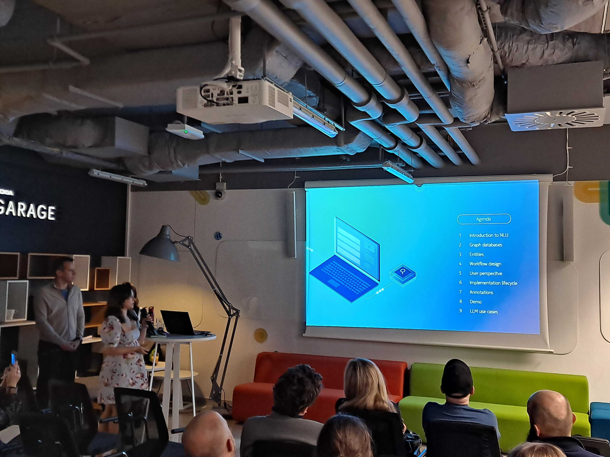
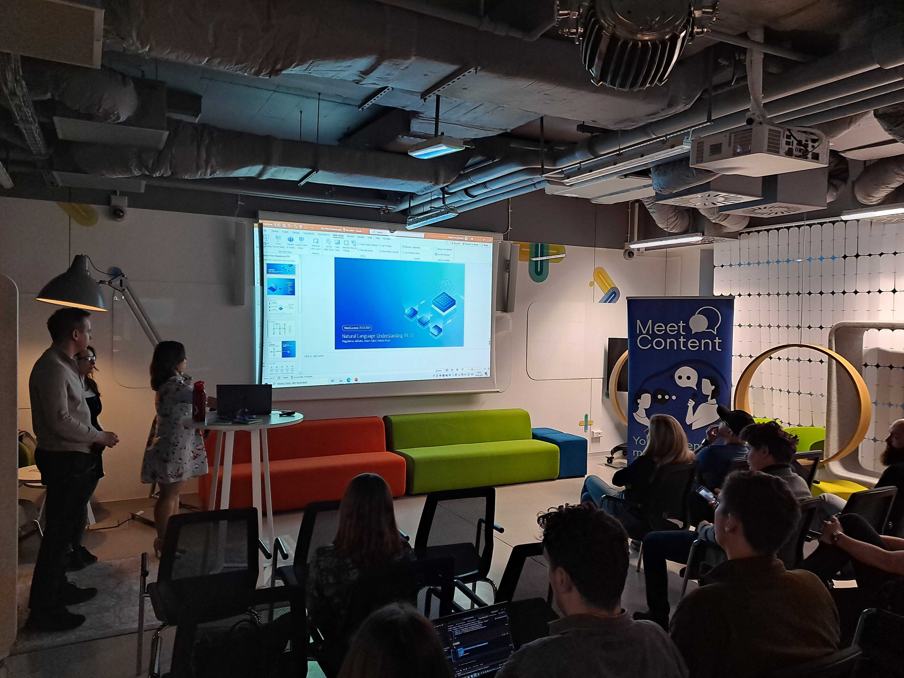

20 marca MeetContentWRO ponownie gościł w inspirującym wnętrzu przy Szybowcowej 2, czyli w Nokia Garage. 

Prezentację pod tytułem *"Smart search results with Natural Language Understanding (NLU)"* dostarczyło wspólnie trzech prelegentów z Nokii:

<!--truncate-->

* Magdalena Jałówko, Product Owner
* [Adam Kąkol](https://www.linkedin.com/in/adam-kakol-14753b135/), Manager obszaru AI-Driven Knowledge Solutions
* [Natalia Rusin](https://www.linkedin.com/in/natalia-rusin-237930221/), UX/UI Designer

## Język naturalny - cel i perspektywa

Nokia zajmuje się tworzeniem urządzeń do komunikacji, na przykład różnych urządzeń radiowych czy nadajników. W związku z tym potrzebuje udokumentować swoje produkty w sposób ustandaryzowany i umożliwiający tysiącom pracowników, klientów i użytkowników rozeznanie się w ogromie sprzętu.

NLU, czyli Natural Language Understanding, to obszar sztucznej inteligencji odpowiedzialny za interakcję między człowiekiem a komputerem, w szczególności za rozumienie i przetwarzanie języka naturalnego.

Nic dziwnego, że potrzebne było zaangażowanie nie-ludzkich 😉 zasobów, żeby to wszystko ogarnąć i uczynić ‘przyjaznym’ dla użytkownika. 

Zespół Adama określił cel i przyjął pewne założenia. 

Określono dwie istotne perspektywy rozumienia języka naturalnego:

* Użytkownika
* Twórcy treści technicznych

Cel z kolei był jasny: Poprawa wyników wyszukiwania w portalu dokumentacyjnym.

## Intencje

Za każdym pytaniem (search query) czai się jakaś potrzeba użytkownika, tak zwana intencja. 

Żeby tę intencję zidentyfikować, zespół Adama:

* Zorganizował serię wywiadów z użytkownikami
* Przeanalizował wyszukiwane terminy

Swoje odkrycia przetłumaczyli na strukturę grafową, zidentyfikowali tak zwane ‘named entities’ oraz relacje między nimi, a następnie stworzyli grafową bazę danych.

Czym zatem jest intencja? Okazuje się, że nieważne jak zadajemy nasze pytania, informacje, których tak naprawdę potrzebujemy da się sprowadzić do pewnych powtarzalnych kategorii. 

Prosty przykład użyty przez naszych prelegentów to:

* Czy jutro będzie padać?
* Czy jutro pogoda będzie dobra na piknik?
* Temperatura jutro we Wrocławiu

Wszystkie te zapytania dotyczą prognozy pogody. I to ona staje się intencją, która je łączy.

Każda intencja ma swoje parametry. Kontynuując przykład prognozy pogody, możemy wyodrębnić takie parametry jak lokalizacja czy data.

W Nokii zidentyfikowano 10 kluczowych intencji, które stały za zapytaniami użytkowników. Przykładowo, jeśli ktoś szukał informacji o wadze jakiegoś sprzętu, jego zapytanie było klasyfikowane jako intencja WYMIARY. 

Często też użytkownicy chcieli porównać podobne sprzęty. Te zapytania były z kolei klasyfikowane jako PORÓWNANIE.

## Grafowe bazy danych

Proste wyszukiwanie po tak zwanych słowach kluczowych nie radzi sobie z dużymi zestawami danych. Poza tym potrzebuje ścisłej i przewidywalnej struktury danych. Takie wymagania sprawiają, że wyszukiwanie staje się niewydajne i często nie generuje właściwych rezultatów. 

Grafowe bazy danych przekładają dane na tak zwane wierzchołki (entities lub nodes). Wierzchołki mają swoje atrybuty (properties), które z kolei niosą kolejne informacje. Każdy wierzchołek może łączyć się z innym wierzchołkiem za pomocą relacji. 

## Semantic search - o co chodzi? 

Semantyczny czyli znaczeniowy, a więc ‘semantic search’ to nic innego jak wyszukiwanie znaczeń, zamiast klasycznego dopasowania słów kluczowych. Dlaczego jest bardziej efektywne? Bo bierze pod uwagę kontekst i znaczenie słów.

## Semantyczna grafowa baza danych 

W Nokii dokonano obróbki dokumentacji produktowej w taki sposób, że każdy dokument został zaanotowany tagami XML. To pozwoliło na sprzęgnięcie wszystkich elementów: zidentyfikowanie wierzchołków, ich atrybutów i wartości oraz relacji. 

Powstała baza danych, która pozwala użytkownikom precyzyjnie przeszukiwać zasoby i sprawniej manipulować danymi, zgodnie z intencją zapytania. 

## I wtedy wchodzi UX...

Jak się domyślacie, trzeba było ten skomplikowany kłębek połączeń przedstawić użytkownikowi w sposób zrozumiały i przejrzysty.  Znowu potrzebne były wywiady z użytkownikami a rezultat to przyjazny interfejs, który w prosty sposób pozwala nawigować poprzez kompleksowość produktów Nokii. Czego byliśmy świadkami podczas demo 🤩

## Pytania od uczestników

Po prezentacji, uczestnicy mieli kilka pytań.

Szczególnie interesowała ich kwestia aktualizowania bazy danych. Okazuje się, że w grafowej bazie danych informacje są zawsze aktualne, bo są powiązane bezpośrednio ze źródłem. Jeśli źródło zostało zaktualizowane, ten stan będzie odzwierciedlony w wynikach wyszukiwania. 

Kolejną kwestią był dostęp do treści, czyli kto powinien widzieć co i jak tym sterować?

Otóż grafowe bazy danych umożliwiają różne poziomy dostępu. Po otrzymaniu zapytania, baza danych identyfikuje poziom dostępu pytającego i pokazuje mu TYLKO te wierzchołki, do których pytający ma dostęp. 

***

Serdecznie dziękujemy marcowym prelegentom oraz naszym niezawodnym uczestnikom 🙌 

Jednocześnie zapraszamy na kolejne wydarzenia MeetContent we Wrocławiu. Najbliższe już **24 kwietnia** w **Ocado**.

Będziemy mieli dla Was aż dwie prezentacje:

* [Monika Mrozek](https://www.linkedin.com/in/monika-mrozek/) opowie o estymacji w zespole Tech Writerskim 
* [Paweł Martin](https://www.linkedin.com/in/pawel-martin/) nakreśli temat tworzenia wewnętrznego portalu developerskiego

Zapisy w formularzu pod [TYM LINKIEM](https://forms.gle/EdBRk7avUJ8QHjre7)! 👋

Do zobaczenia! 

  